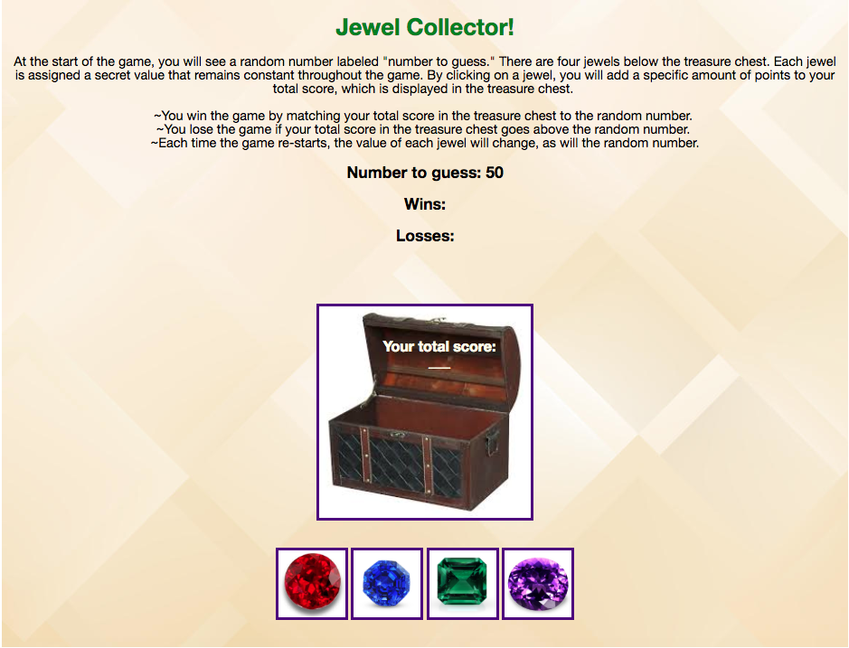

Jewel Collector - a math and memory game for young children

There are four jewels displayed as buttons on the page.

The player is shown a random number at the start of the game.

When the player clicks on a jewel, it adds a specific amount of points to the player's total score. However, this amount remains a mystery until the player clicks the jewel, at which point the score counter is updated by the number of points assigned to that jewel.

The player wins if his/her total score matches the random number from the beginning of the game.

The player loses if his/her score goes above the random number.

The game restarts whenever the player wins or loses, at which point a new random number appears. Also, all the jewels will have four new hidden values. 

-----------
This game was created with HTML, CSS, and JavaScript.
